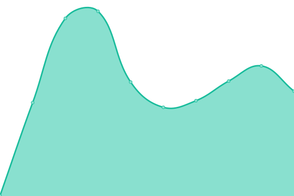

# [📈 Live Status](https://uptime.nephos.gr): <!--live status--> **🟧 Partial outage**

This repository contains the open-source uptime monitor and status page for [Nubis PC](https://uptime.nephos.gr), powered by [Upptime](https://github.com/upptime/upptime).

With [Upptime](https://upptime.js.org), you can get your own unlimited and free uptime monitor and status page, powered entirely by a GitHub repository. We use [Issues](https://github.com/nubispc/upptime/issues) as incident reports, [Actions](https://github.com/nubispc/upptime/actions) as uptime monitors, and [Pages](https://uptime.nephos.gr) for the status page.

<!--start: status pages-->
<!-- This summary is generated by Upptime (https://github.com/upptime/upptime) -->
<!-- Do not edit this manually, your changes will be overwritten -->
<!-- prettier-ignore -->
| URL | Status | History | Response Time | Uptime |
| --- | ------ | ------- | ------------- | ------ |
|  [Nubis Website](https://nubis-pc.eu) | 🟩 Up | [nubis-website.yml](https://github.com/nubispc/upptime/commits/HEAD/history/nubis-website.yml) | 

 1328ms
     
 | 

<a href="https://uptime.nephos.gr/history/nubis-website">98.66%</a>
    

|  [S3](https://s3.nbfc.io) | 🟩 Up | [s3.yml](https://github.com/nubispc/upptime/commits/HEAD/history/s3.yml) | 

 706ms
     
 | 

<a href="https://uptime.nephos.gr/history/s3">100.00%</a>
    

|  [owncloud](https://owncloud.nbfc.io) | 🟩 Up | [owncloud.yml](https://github.com/nubispc/upptime/commits/HEAD/history/owncloud.yml) | 

 1144ms
     
 | 

<a href="https://uptime.nephos.gr/history/owncloud">100.00%</a>
    

|  [Mail server](https://mail.nubificus.co.uk) | 🟩 Up | [mail-server.yml](https://github.com/nubispc/upptime/commits/HEAD/history/mail-server.yml) | 

 809ms
     
 | 

<a href="https://uptime.nephos.gr/history/mail-server">100.00%</a>
    

|  [Monitoring-1](https://monit.nubificus.co.uk) | 🟩 Up | [monitoring-1.yml](https://github.com/nubispc/upptime/commits/HEAD/history/monitoring-1.yml) | 

 1149ms
     
 | 

<a href="https://uptime.nephos.gr/history/monitoring-1">100.00%</a>
    

|  [Monitoring-2](https://grafana.nephos.gr) | 🟥 Down | [monitoring-2.yml](https://github.com/nubispc/upptime/commits/HEAD/history/monitoring-2.yml) | 

 1234ms
     
 | 

<a href="https://uptime.nephos.gr/history/monitoring-2">0.00%</a>
    

|  [OpenFaaS main cluster (nodeinfo)](https://openfaas.nbfc.io/function/nodeinfo) | 🟩 Up | [open-faa-s-main-cluster-nodeinfo.yml](https://github.com/nubispc/upptime/commits/HEAD/history/open-faa-s-main-cluster-nodeinfo.yml) | 

 684ms
     
 | 

<a href="https://uptime.nephos.gr/history/open-faa-s-main-cluster-nodeinfo">100.00%</a>
    

|  [OpenFaaS testbed cluster (cows)](https://openfaas.serrano.nbfc.io/function/cows) | 🟥 Down | [open-faa-s-testbed-cluster-cows.yml](https://github.com/nubispc/upptime/commits/HEAD/history/open-faa-s-testbed-cluster-cows.yml) | 

 0ms
     
 | 

<a href="https://uptime.nephos.gr/history/open-faa-s-testbed-cluster-cows">0.00%</a>
    

|  [knative testbed cluster (hellofc)](https://hellofc.default.knative.nbfc.io) | 🟥 Down | [knative-testbed-cluster-hellofc.yml](https://github.com/nubispc/upptime/commits/HEAD/history/knative-testbed-cluster-hellofc.yml) | 

 2829ms
     
 | 

<a href="https://uptime.nephos.gr/history/knative-testbed-cluster-hellofc">99.76%</a>
    

|  [knative testbed cluster (hellocontainer)](https://hellocontainer.default.knative.nbfc.io) | 🟩 Up | [knative-testbed-cluster-hellocontainer.yml](https://github.com/nubispc/upptime/commits/HEAD/history/knative-testbed-cluster-hellocontainer.yml) | 

 1931ms
     
 | 

<a href="https://uptime.nephos.gr/history/knative-testbed-cluster-hellocontainer">100.00%</a>
    

<!--end: status pages-->

[**Visit our status website →**](https://uptime.nephos.gr)

## 📄 License

- Powered by: [Upptime](https://github.com/upptime/upptime)
- Code: [MIT](./LICENSE) © [Nubis PC](https://uptime.nephos.gr)
- Data in the `./history` directory: [Open Database License](https://opendatacommons.org/licenses/odbl/1-0/)
